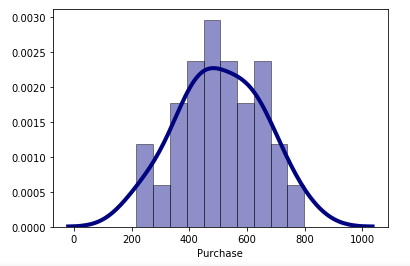

# AB_TEST-and-Facebook-Ad-Analysis

# SCOPE

The aim of this project is to measure performance of Facebook advertisement by using AB TEST

# WHAT HAVE BEEN DONE

* Data sets were imported from excel sheet where there were to subsheets (Control and Test group)
* The columns of the data sets had structural error, and I renamed them.
* I analysed and pre-processed the data sets
  * The purchase feature of the Control group had 3 NaN values. I checked the distribution of the purchase values and ı saw that it had normal distribution. Therefore I used mean of purchase values to fill NaN values in the Control group. 
* To different groups were compared, therefore I chose to use Independent Two Sample T-Test(AB Test) that has to Test Assumption Controls.
* I achieved Independent Two Sample T-Test Assumption Controls(AB Test) and the result is:
    While the assumption of variance homogeneity, which is one of the assumption tests, provides the condition, the normal distribution assumption could not be achieved. 
* Therefore I applied the Non-Parametric test (**mannwhitneyu test**)

# Conclusion

The p-value of mannwhitneyu test is 0.1744. Since pvalue = 0.1744 is greater than alpha = 0.05, there is **NO SIGNIFICANT DIFFERENCE** between Purchase values of Control and Test groups.

**So the Ho: µ1 = µ2 hypothesis, which says there is no difference, is not rejected.**

# Appendix

